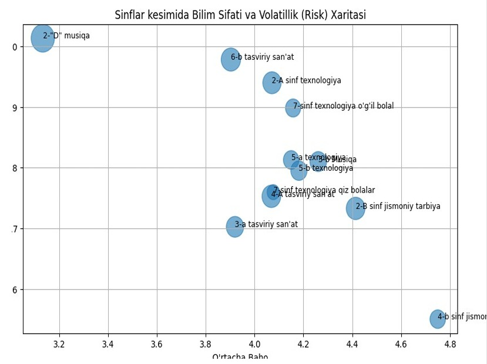
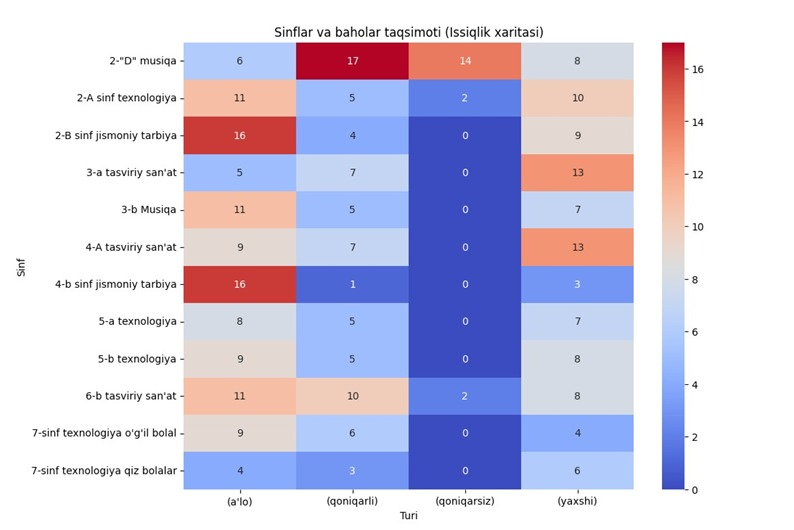
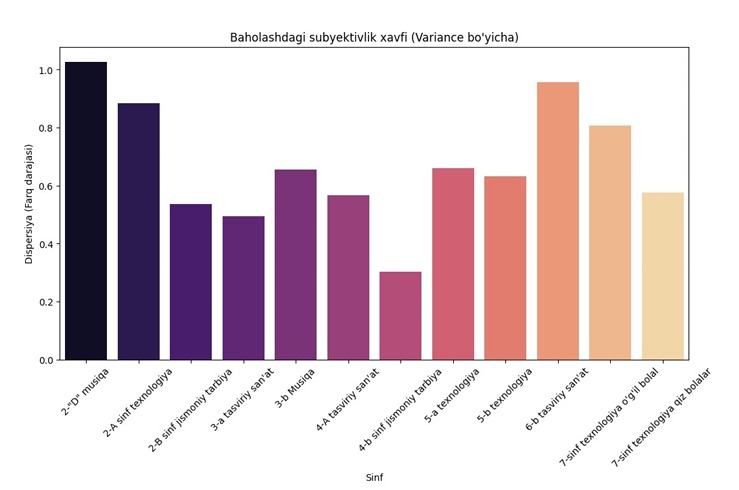

This project was created for educational and portfolio purposes, with the intent of surfacing patterns that could support constructive conversations with teachers and school administration — not to single out or evaluate any individual student, teacher, or class publicly.

# Regarding the quarterly and final exam grades for primary and secondary levels at School No. 53 for the 2024–2025 academic year:
| Class Name | Average Grade (Mean) | Volatility (Std Dev) | Student Count |
| :--- | :---: | :---: | :---: |
| **2-D Music** | 3.13 | 1.01 | 45 |
| **2-A Technology** | 4.07 | 0.94 | 28 |
| **2-B Physical Education** | 4.41 | 0.73 | 29 |
| **3-A Fine Arts** | 3.92 | 0.70 | 25 |
| **3-B Music** | 4.26 | 0.81 | 23 |
| **4-A Fine Arts** | 4.07 | 0.75 | 29 |
| **4-B Physical Education** | 4.75 | 0.55 | 20 |
| **5-A Technology** | 4.15 | 0.81 | 20 |
| **5-B Technology** | 4.18 | 0.80 | 22 |
| **6-B Fine Arts** | 3.90 | 0.98 | 31 |
| **7th Grade Technology (Boys)** | 4.16 | 0.90 | 19 |
| **7th Grade Technology (Girls)** | 4.08 | 0.76 | 13 |

A low number of unsatisfactory grades may indicate a teacher's tendency to award positive grades, which leads to students acquiring only a superficial understanding.

A wide gap between grades shows either an absence of subjectivity in assessment or that only some of the students are interested in the lessons.

Recommendations:

Pedagogical Audit: Organize open classes to review teaching methodologies for 2-D Music and 6-B Fine Arts.

Grade Calibration: Conduct a short workshop for all teachers on the specific criteria for awarding "Excellent" or "Good" grades.
Individual Approach: For classes with high columns in the red zone (unsatisfactory/satisfactory) on the heatmap, enroll students in additional extracurricular clubs.

The high dispersion (large gap) in 2-D Music and 6-B Fine Arts indicates that students' academic performance varies sharply from one another, or the teacher is using a very wide grading range.

In 4-A Fine Arts and 2-B Physical Education, student grades are close, which means students' knowledge levels are similar or the teacher is grading based on strict, precise criteria.

Recommendation:

Because large gaps in grades can increase stress among students, teachers should rely on a unified grading rubric for assessments.
Grading based on clear criteria reduces assessment subjectivity and increases student engagement.

ANALYSIS REPORT :

Highest Performance: 4-B Physical Education (Average: 4.75)

Critical Point: 2-"D" Music (Average: 3.13)

Risk of Grading Inconsistency: 2-"D" Music (Variance: 1.03)

<table align="center" width="100%">
  <thead>
    <tr>
      <th align="left">Class Name</th>
      <th align="center">Average Grade</th>
      <th align="left">AI Diagnosis (Status)</th>
    </tr>
  </thead>
  <tbody>
    <tr>
      <td><b>4-b sinf jismoniy tarbiya</b></td>
      <td align="center">4.75</td>
      <td>🟢 High performance</td>
    </tr>
    <tr>
      <td><b>2-B sinf jismoniy tarbiya</b></td>
      <td align="center">4.41</td>
      <td>🟢 High performance</td>
    </tr>
    <tr>
      <td><b>3-b Musiqa</b></td>
      <td align="center">4.26</td>
      <td>🟡 Stable average</td>
    </tr>
    <tr>
      <td><b>5-b texnologiya</b></td>
      <td align="center">4.18</td>
      <td>🟡 Stable average</td>
    </tr>
    <tr>
      <td><b>7-sinf texnologiya (o'g'il)</b></td>
      <td align="center">4.16</td>
      <td>🟡 Stable average</td>
    </tr>
    <tr>
      <td><b>5-a texnologiya</b></td>
      <td align="center">4.15</td>
      <td>🟡 Stable average</td>
    </tr>
    <tr>
      <td><b>7-sinf texnologiya (qiz)</b></td>
      <td align="center">4.08</td>
      <td>🟡 Stable average</td>
    </tr>
    <tr>
      <td><b>2-A sinf texnologiya</b></td>
      <td align="center">4.07</td>
      <td>🟡 Stable average</td>
    </tr>
    <tr>
      <td><b>4-A tasviriy san'at</b></td>
      <td align="center">4.07</td>
      <td>🟡 Stable average</td>
    </tr>
    <tr>
      <td><b>3-a tasviriy san'at</b></td>
      <td align="center">3.92</td>
      <td>🟡 Stable average</td>
    </tr>
    <tr>
      <td><b>6-b tasviriy san'at</b></td>
      <td align="center">3.90</td>
      <td>🟡 Stable average</td>
    </tr>
    <tr>
      <td><b>2-"D" musiqa</b></td>
      <td align="center">3.13</td>
      <td>🔴 Critical condition</td>
    </tr>
  </tbody>
</table>
